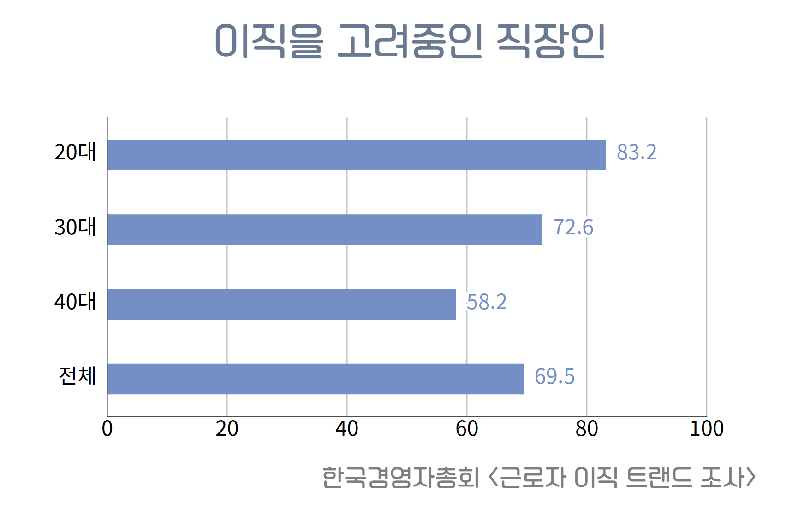
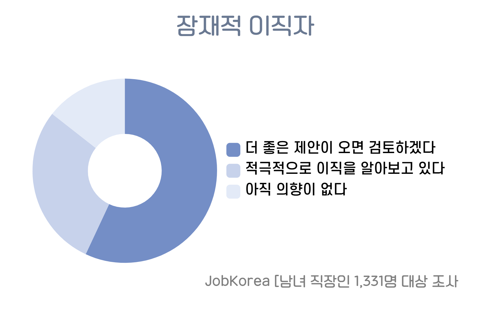
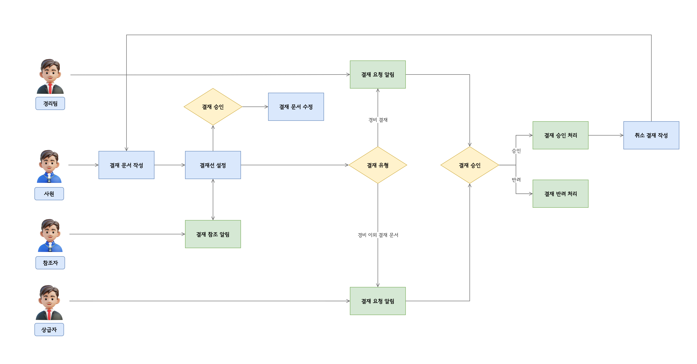
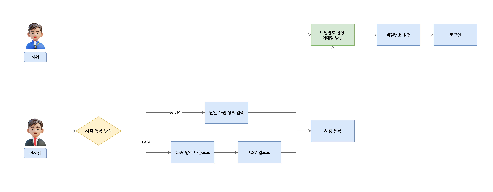
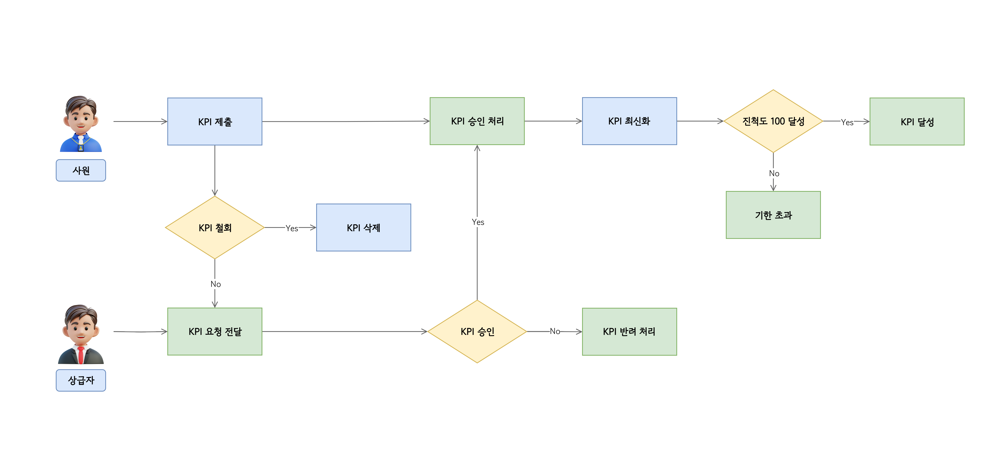
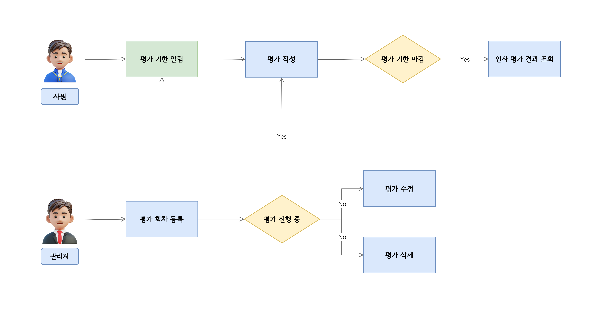
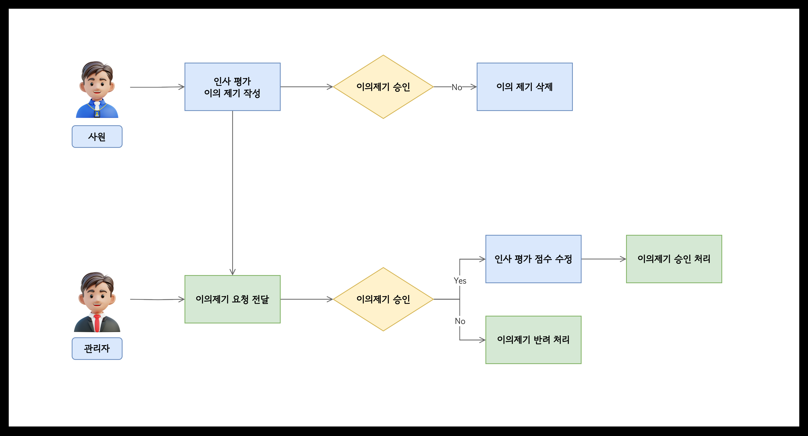
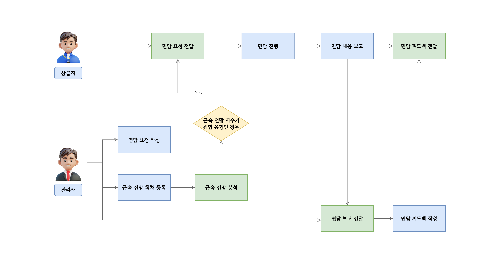
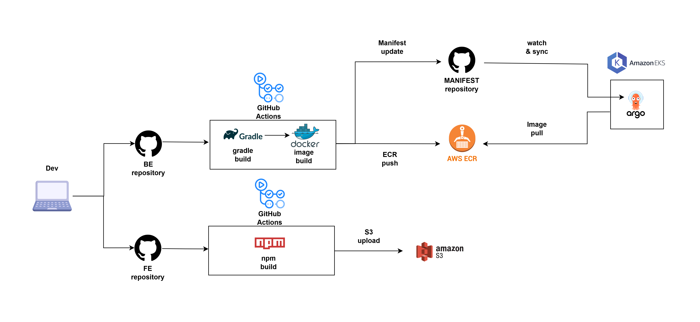

## 📚 목차

1. [🏆 팀 소개](#1--팀-소개)
2. [📘 프로젝트 기획서](#2--프로젝트-기획서)
3. [🛠️ 기술 스택](#3-%EF%B8%8F-기술-스택)
4. [📁 프로젝트 구조](#4--프로젝트-구조)
5. [🛠 형상 관리](#5--형상-관리)
6. [📊 산출물](#6--산출물)
    - [📊 WBS](#1--wbs-작업-분배-및-일정)
    - [📄 요구사항 정의](#2--요구사항-정의서)
    - [🔄 플로우 차트 & UML](#3--플로우-차트--uml)
    - [📦 DDD](#4--ddd)
    - [📌 ERD & 테이블 정의서](#5--erd--테이블-정의서)
    - [🧩 기능 정의서](#6--기능-정의서)
    - [📐 시스템 아키텍처 구조도](#7--시스템-아키텍처-구조도)
    - [💻 화면 설계서](#8--화면-설계서)
    - [🧾 테스트 케이스 정의서](#9--테스트-케이스-정의서)
    - [📜 단위 테스트 문서](#10--단위-테스트-문서)
    - [📚 SWAGGER 문서](#11--swagger-문서)
    - [🧪 테스트 케이스 상세](#12--테스트-케이스-상세)
    - [🗄️ 빌드 및 배포](#13--빌드-및-배포)
7. [🫂 팀원 회고](#6--팀원-회고)

<br>

---

## 1. 🏆 팀 소개

<div align="center">

<br>

<table>
  <tr>
    <td align="center"><a href="https://github.com/mijuckboon"><b>곽진웅</b></a></td>
    <td align="center"><a href="https://github.com/meowdule"><b>김여진</b></a></td>
    <td align="center"><a href="https://github.com/Taein5415"><b>김태인</b></a></td>
    <td align="center"><a href="https://github.com/splguyjr"><b>김운경</b></a></td>
    <td align="center"><a href="https://github.com/devyujinjeong"><b>정유진</b></a></td>
  </tr>
  <tr>
    <td align="center"></td>
    <td align="center"></td>
    <td align="center"></td>
    <td align="center"></td>
    <td align="center"></td>
  </tr>
  <tr>
    <td align="center">근태 및 사원 관리</td>
    <td align="center">평가 관리, 근속 전망</td>
    <td align="center">인적 사항 관리</td>
    <td align="center">챗봇, 알림, 공지사항</td>
    <td align="center">결재 관리</td>
  </tr>
</table>

<br>

<table>
  <tr>
    <td align="center"><b>안성민</b></td>
    <td align="center"><b>소용준</b></td>
  </tr>
  <tr>
    <td align="center"></td>
    <td align="center"></td>
  </tr>
  <tr>
    <td align="center"><b>멘토님</b></td>
    <td align="center"><b>자문 교수님</b></td>
  </tr>
</table>

</div>


<br>

---

## 2. 📘 프로젝트 기획서

## ❝ 인사 관리 플랫폼에서 근속 예측까지 ❞
구성원의 작은 변화 신호를 읽어내어 근속 가능성을 예측하는 통합 HR 솔루션

> 평가, 성과, 근태 결국 모두 ‘사람이 움직이는 신호’입니다.
> 
> Momentum은 그 신호들을 읽고, 연결하고, 조직이 나아갈 방향으로 추진력 을 만들어냅니다


🔗 [Momentum](https://momentum-dao.site/intro)

---

<br>

<details open>
<summary>📘 프로젝트 개요</summary>

<br>

<details open>
<summary> &emsp;1. 🧩 기획 배경 및 문제 의식 </summary>


|  |  |
|-----------------------------------------|-----------------------------------------|

<br>

<details>
<summary> &emsp; &emsp;1-1. 이직은 더 이상 예외가 아니다 – 직장인의 인식 변화 </summary>

과거에는 "평생 직장"이라는 개념이 자연스럽게 받아들여졌지만,

**최근에는 이직이 커리어 전략의 일부로 인식**되고 있습니다.

### 📊 직장인의 이직 고려 비율 *(한국경영자총협회 조사)*

- **20대**: 83.2%
- **30대**: 72.6%
- **40대**: 58.2%
- **전체 평균**: 69.5%

이는 단순히 개인의 문제가 아닌, 기업 전체가 대응해야 할 **사회적 흐름**임을 시사합니다.

</details>

<br>

<details>
<summary> &emsp; &emsp;1-2. 직장인이 이직을 고려하는 방식 – JobKorea 설문 조사 </summary>

> JobKorea가 직장인 1,331명을 대상으로 진행한 조사 결과,
>
>
> **잠재적 이직자**가 조직 내 상당수에 달함
>

### 이직 태도별 분류:

1. **더 좋은 제안이 온다면 고려**하겠다 – ✅ 대부분이 해당
2. **이직을 적극적으로 알아보고 있음** – 일부
3. **아직은 이직 의향 없음** – 소수

 →  즉, 당장 이직하진 않더라도 **‘이직 가능성’은 거의 모두에게 열려 있음**

</details>

<br>

<details>
<summary> &emsp; &emsp;1-3. 이직이 조직에 미치는 실질적 피해 – 단발성 비용이 아니다 </summary>

직원이 퇴사하면 단지 한 명을 대체하는 문제가 아닙니다.

**조직 전반에 연쇄적인 손실**이 발생합니다.

### ✅ 직접 비용

- 채용 공고 게시
- 면접 일정 조율 및 인터뷰 진행
- 신규 입사자 교육
- 관리자 및 HR 리소스 소모
- 퇴사 처리 행정 절차

### ✅ 간접 비용

- 해당 직무의 공백 → **생산성 손실**
- 기존 팀원의 **추가 업무 부담**
- 신규 입사자의 **적응 기간 및 오류 발생**
- **조직 사기 및 분위기 악화**

### ✅ 연쇄 비용

> “한 명의 이직이 또 다른 이직을 부른다.”
>
- 인력 공백에 따른 과중 업무

  → **남은 구성원의 피로도 상승**

  → **불만 누적 → 추가 이직 발생**

  → 비용 반복 증가의 **악순환**

</details>

<br>

| 항목 | 내용 |
| --- | --- |
| 사회 변화 | 이직은 당연한 경력 선택으로 인식됨 |
| 조직 문제 | 이직은 단순히 인사 한 건이 아니라 **지속 비용과 악순환** 유발 |
| 대응 필요 | **이직의 전조를 조기에 감지하고 대응**하는 HR 시스템이 필요함 |

</details>

<br>

<details>
<summary> &emsp;2. 💻 기존 대응 사례 및 한계</summary>

<br>

<details>
<summary> &emsp; &emsp;2-1. 일부 기업들의 대응 – 한화 Break Fast 전략</summary>

일부 기업은 **채용 초기 단계부터 장기 근속 가능성을 고려한 전략**을 도입 중입니다.

대표 사례: **한화의 ‘Break Fast’ 프로그램**

### ✅ 프로그램 개요

- 채용 → 실무 인턴십 → 평가 → 입사 확정까지의 절차에서

  **근속 가능성 높은 인재를 조기 식별**

- 단기 성과 중심이 아닌 **조직 적응성과 지속성을 중시**

### 🧩 전형 프로세스

| 단계 | 내용 |
| --- | --- |
| 1. 채용 전형 | 서류 접수 (4/1~4/15)  실무 면접, 임원 면접 |
| 2. 예행 인턴십 | 6주간 실무 수행 및 평가 (6월~7월) |
| 3. Break | 평가 후 일정 기간 쉼 |
| 4. 정규 입사 | 최종 입사 확정 (2025년 1월 예정) |

📌 *입사 전까지는 근속 검증을 하되, 입사 후에는 관리 체계가 부재*

</details>

<br>

<details>
<summary> &emsp; &emsp;2-2. 기존 HR SaaS 서비스 현황</summary>

현재 시장에는 다양한 HR 서비스들이 존재하지만,

**대부분은 행정 중심 시스템**으로 기능이 제한적입니다.

### 🧩 주요 서비스 예시

| 서비스명 | 주요 기능 |
| --- | --- |
| **리멤버** | 전자근로계약, 인사 기록 관리 |
| **flex** | 인사 정보 관리, 급여 계산, 근태/연차 처리 |
| **space** | 업무 관리, 피드백, 전자 결재 |
| **ninehire** | 채용 전형 관리, 일정 조율, 커뮤니케이션 자동화 |

### 🔍 공통 기능 범위

- **인사 관리**: 사원정보, 계약서 관리
- **근태 관리**: 출퇴근 기록, 연차 관리, 52시간제 대응
- **성과 관리**: KPI, 역량 평가
- **업무 지원**: 결재 시스템, 공지 관리, 일정 알림

### ❌ 하지만 놓치고 있는 것

> 이직 위험이나 근속 예측은 전혀 다루지 않음
>
- 구성원의 변화나 신호를 **데이터 기반으로 해석하는 기능 없음**
- **지표 기반 근속 전망**, **실시간 리스크 탐지**, **선제적 개입 기능** 부재

</details>

<br>

| 구분 | 내용 |
| --- | --- |
| 기업 전략 사례 | 한화 등 일부 기업은 채용 전 단계에서 근속 검증 시도 |
| 시장 현황 | 다양한 HR SaaS가 존재하지만, 행정 처리 중심 |
| 본질적 한계 | **입사 이후** 구성원의 근속 리스크를 **파악하거나 개입할 수 있는 시스템이 없음** |

</details>

<br>

<details>
<summary> &emsp;3. 🔁 Momentum 서비스 소개</summary>

<br>


## ❝ 인사 관리 플랫폼에서 근속 예측까지 ❞
구성원의 작은 변화 신호를 읽어내어 근속 가능성을 예측하는 통합 HR 솔루션

> Momentum는 단순한 인사 기록을 넘어, 구성원의 작은 신호까지 읽어냅니다.
> 
> 평가, 성과, 근태 결국 모두 ‘사람이 움직이는 신호’입니다.
>
> Momentum은 그 신호들을 읽고, 연결하고, 조직이 나아갈 방향으로 추진력 을 만들어냅니다

<br>

### ❓ 기존 HR 시스템은 왜 부족했는가?

- 대부분의 HR 시스템은 **기록/처리 중심**입니다.
- 구성원의 이직 위험은 **'숫자 뒤의 신호'**에서 시작됩니다.

> 📌 “성과, 근태, 평가, 일정 등은 모두 사람의 ‘움직임’을 반영한 신호입니다.”
>

<br>

### 🔍 Momentum

> “Momentum은 그 신호들을 읽고, 연결하고,
조직이 나아갈 방향으로 추진력을 만들어냅니다.”
>


| 기존 HR 시스템 | Momentum |
| --- | --- |
| 단순 이력 관리 | 변화의 신호를 읽는 감지기 |
| 사후 대응 | **사전 예측과 개입** 중심 |
| 정적인 인사 데이터 | 연결된 흐름에서 **의미 있는 패턴** 추출 |
| 정보 단절 | 평가 → 근태 → 계약까지 **연결된 프로세스** |

<br>

| 항목 | 내용 |
| --- | --- |
| 서비스 정의 | 구성원의 작은 신호까지 감지하는 **근속 예측 중심 HR 플랫폼** |
| 차별점 | 기존 기록 중심 HR 시스템과 달리, **데이터 연결성과 예측력에 집중** |
| 목표 | **사람의 변화에 즉각 반응하고, 조직의 유지율을 높이는 추진력 제공** |


</details>

<br>

<details open>
<summary> &emsp;4. 🎯 핵심 기능 구조</summary>

Momentum의 주요 기능은 다음과 같이 6개 카테고리로 구성됩니다.  

---

### 📂 기능 카테고리 요약

1. **인사 관리 (HR Management)**  
   → 사원 정보, 조직도, 권한, 계약 등 인사 전반 관리 기능

2. **근태 관리 (Attendance)**  
   → 출퇴근, 휴가, 재택/출장 신청, 통계 등 근무시간 기반 기능

3. **결재 기능 (Approval)**  
   → 정정/신청/승인 문서 작성 및 결재선 지정, 히스토리 관리

4. **성과 평가 (Performance Evaluation)**  
   → KPI, 다면 평가, 가중치 기반 인사 등급 및 이의 제기 처리

5. **근속 지원 (Retention Support)**  
   → 회차별 분석, 근속 유형 분류, 면담 기록 흐름 설계

6. **기타 관리 기능 (Notification, Chatbot, Notice)**  
   → 공지사항, 알림 자동화, 챗봇 기반 기능 가이드 및 상담 기능

<br>

> “HR 시스템은 누구나 모든 데이터를 보는 것이 아니라,
>
>
> **역할에 따라 적절한 수준의 정보와 조치 권한을 제공**해야 합니다.”
>

Momentum은 실제 조직 운영에 맞게,

**4단계 권한 체계**를 기반으로 사용자 기능을 구분합니다.

| 권한 등급 | 정의 |
| --- | --- |
| 최고 관리자 (Super Admin) | 전체 회사 운영을 총괄하는 관리자 |
| 인사 관리자 (HR Manager) | 인사·평가·근속관리 전반을 담당 |
| 팀장 (Team Leader) | 팀 단위의 KPI·평가·면담을 관리 |
| 사원 (Employee) | 본인 정보 조회, 평가 참여 등 |

---

각 기능은 아래 개별 상세 섹션에서 기술됩니다.

<details>
<summary> &emsp; &emsp;1. 인사 관리 기능 (HR Management)</summary>

### 1.1 관리자 및 조직 정보

- **회사 정보 관리**
    - 최고 관리자는 다음 항목을 포함한 회사 정보를 등록/수정할 수 있다:
        - **필수 항목**: 회사명, 대표자 이름, 설립일, 회사 주소, 회사 연락처, 회사 이메일, 월급일, 출근시간, 퇴근시간, 접속 허용 IP 주소
        - **선택 항목**: 사업자등록번호, 법인등록번호
    - 등록된 회사 정보는 전체 사원이 열람할 수 있으며, 수정은 최고 관리자만 가능하다.
- **조직도 관리**
    - 모든 사원은 조직도를 조회할 수 있다.
    - 조직도는 부서별 계층 구조로 시각화되며, 상하위 관계를 직관적으로 파악할 수 있다.
    - 특정 부서 클릭 시 해당 부서 소속 사원의 이름, 직위, 이메일, 연락처 정보가 나타난다.
- **부서 / 직위 / 직책 관리**
    - 최고 관리자는 다음 정보를 등록/수정/삭제할 수 있다:
        - 부서 정보: 부서명, 부서 주요 업무, 부서 연락처
        - 직위 정보: 직위명, 직위 단계 (단계는 숫자 or 정렬 기준)
        - 직책 정보: 직책명, 직책 설명
    - **직위는 단계 기반(예: 사원 < 대리 < 과장 등)**, **직책은 역할 기반(예: 팀장, 인사관리자 등)**으로 정의되며 별도로 관리된다.
    - 직위 또는 직책 삭제 시 해당 항목이 부여된 사원이 존재하면 삭제할 수 없다.

---

### 1.2 사원 정보 및 발령

- **사원 정보 등록**
    - 최고 관리자 및 인사 관리자는 사원을 **단건 등록** 또는 **CSV 업로드 방식**으로 등록할 수 있다.
    - 시스템은 CSV 양식을 제공하며, 양식 미준수 시 업로드가 제한된다.
    - 등록 항목:
        - 기본 정보: 사번, 이름, 성별, 생년월일, 연락처, 주소, 이메일, 입사일, 재직 상태
        - 인사 정보: 소속 부서, 직위, 직책
        - 계약 정보: 고용 형태, 계약일, 계약서 파일 업로드
        - 학력, 자격증, 수상 이력, 경력 정보 포함
- **사원 정보 상세 조회 및 수정**
    - 최고 관리자 및 인사 관리자는 전체 사원의 정보를 상세 조회 및 수정할 수 있다.
    - 조회 정보: 기본 정보, 인사 정보, 계약 정보, 경력 및 학력 정보
    - 수정 항목: 이메일, 재직상태, 연락처, 주소 등
    - 수정 시 유효성 검증 로직이 동작하며, 잘못된 형식은 저장되지 않는다.
- **인사 발령 관리**
    - 인사 관리자는 사원의 발령 이력을 등록/조회할 수 있다.
    - 발령 유형: 소속 이동, 승진 등
    - 발령 시 기존 직위/부서와 변경 직위/부서를 함께 기록한다.
    - 발령 내역은 조직도 및 결재선에 자동 반영된다.

---

### 1.3 프로필 및 개인정보

- **사원 프로필 조회**
    - 모든 사원은 본인의 프로필을 조회할 수 있다.
- **개인정보 수정**
    - 사원은 프로필에서 자신의 개인정보를 수정할 수 있다.
    - 수정 가능 항목:
        - 연락처, 주소, 성별, 생년월일
        - 비밀번호: 기존 비밀번호 인증 후 변경 가능
    - 이메일 변경은 관리자 권한을 가진 사원만이 수정할 수 있다.
    - 학력, 경력, 자격증, 수상 이력 등의 인사 정보는 인사 관리자가 등록 및 수정한다.
- **캘린더 통합 조회**
    - 대시보드에서 다음 항목의 일정을 확인할 수 있다:-
      - 근태 기록 (출퇴근, 휴가, 출장 등)
      - 성과 평가 일정
      - 결재 일정
      - 회사 휴일
- **비밀번호 초기화 및 설정**
    - 사원은 로그인 화면에서 비밀번호 재설정 이메일을 요청할 수 있다.
        - 인증 토큰은 24시간 유효하며, 이메일을 통해 링크 제공
    - 비밀번호 변경 화면에서는 새 비밀번호와 재입력 항목을 확인하며 변경 가능

---

### 1.4 권한 및 계약 관리

- **권한 관리**
    - **최고 관리자**는 사원 권한을 등록/수정할 수 있다.
    - 권한 유형:
        - 최고 관리자: 전체 기능 접근 및 설정 가능
        - 인사 관리자: 인사/근태/계약/평가 기능 접근
        - 경리 관리자: 영수증 결재 처리 기능
        - 일반 사원: 본인 정보 및 제한 기능만 접근 가능
    - **직책 권한**:
        - 직책(예: 팀장)은 조직도 내 위치에 따라 별도의 접근 권한을 가진다.
        - 예시: 팀장은 하위 팀원들의 근태 내역, 결재 문서, KPI, 평가 결과를 열람/처리할 수 있음
- **권한 부여 UI**
    - 권한은 조직도 기반 좌측 트리 UI에서 특정 사원을 선택하여 수정할 수 있다.
    - 체크박스를 통해 권한 항목을 선택하고 [권한변경] 버튼으로 저장한다.
- **계약 관리**
    - 최고 관리자 및 인사 관리자는 **사원별 계약서**를 업로드하고 내역을 관리할 수 있다.
    - 계약서 정보:
        - 계약서 유형, 등록일자, 연봉 등
        - PDF 계약서 파일 첨부 및 미리보기 기능 제공

</details>

<br>


<details>
<summary> &emsp; &emsp;2. 근태 관리 기능 (Attendance)</summary>


### 2.1 출퇴근 관리

- **출퇴근 처리 (IP 기반 제한)**
    - 사원은 **회사에서 지정한 IP 대역** 내에서만 출근/퇴근 버튼을 클릭할 수 있다.
    - 외부 IP에서 접근 시, 오류 모달이 출력되며 출근 기록이 차단된다.
    - 출근 버튼 클릭 시:
        - 시스템은 **현재 시각과 회사 지정 출근 시간 중 더 늦은 시각**을 출근 시각으로 기록한다.
    - 퇴근 버튼 클릭 시:
        - 시스템은 **현재 시각과 회사 지정 퇴근 시간 중 더 이른 시각**을 퇴근 시각으로 기록한다.
    - 출근/퇴근 시간 외에 **등록 시각(start_pushed_at, end_pushed_at)** 및 **휴게 시간**도 함께 기록된다.
- **출퇴근 내역 조회**
    - 사원은 본인의 출퇴근 내역을 일별, 월별로 확인할 수 있다.
    - 관리자 및 인사팀은 전체 사원의 출퇴근 이력을 조회할 수 있으며, 다음 필터를 제공한다:
        - 사번, 이름, 부서, 직위, 날짜 범위, 근무 유형, 정상 근무 여부
    - 조회 항목: 시작 시각, 종료 시각, 근무 시간, 근무 유형(정상/초과/휴가), 휴게 시간
    - 상세보기 모달에서는 실제 등록 시각 및 상세 로그 확인 가능
    - 정렬은 기본적으로 시작 시각 오름차순이며 변경 가능
- **출퇴근 정정 신청**
    - 사원은 다음 사유로 정정 신청을 할 수 있다:
        - 출근 누락, 조퇴, 지각, 퇴근 누락, 초과 근무 시간 수정 등
    - 신청 항목: 기존 시각, 수정 시각, 정정 사유
    - 승인 시 해당 출퇴근 기록에 반영되며, 반려 시 사유가 표시된다.

---

### 2.2 재택 근무 신청

- **재택 근무 신청**
    - 사원은 재택 근무 시작일, 종료일, 사유(선택)을 입력하여 신청할 수 있다.
    - 팀장은 승인 또는 반려 처리할 수 있으며, 반려 시 사유는 필수로 입력해야 한다.
    - 상태별(대기/승인/반려) 필터 제공
    - 관리자는 전체 재택 신청 내역을 확인할 수 있다.
- **외근 신청** *(향후 발전 과제)*
    - 사원은 외근 신청 시 다음 정보를 입력한다:
        - 외근 일자, 시간대, 장소, 사유
    - 팀장이 승인하며, 승인/반려 내역은 사원이 확인 가능
    - 외근 내역은 출퇴근 기록에서 **근무 유형: 외근**으로 구분되어 집계된다.

---

### 2.3 출장 관리

- **출장 신청 및 승인**
    - 사원은 출장 신청 시 다음 정보를 입력한다:
        - 출장 일자, 출장 기간, 장소, 출장 목적, 예상 비용
    - 출장 유형은 국내/해외 중 선택
    - 팀장이 승인/반려할 수 있으며, 승인된 출장 기록은 근태 내역에 자동 반영된다
    - 반려 사유 입력은 필수이며, 상태별 조회 가능

---

### 2.4 연차 / 반차 / 병가 등 휴가 신청

- **휴가 신청 유형**
    - 사원은 다음 유형의 휴가를 신청할 수 있다:

        1. 연차
        2. 반차 (오전/오후)
        3. 리프레시 휴가
        4. 군소집훈련
        5. 경조사
        6. 기타 유급휴가
        7. 기타 무급휴가

- **휴가 신청 및 승인 흐름**
    - 신청 시: 휴가 유형, 시작일, 종료일, 사유, 필요 시 증빙서류 첨부
    - 팀장이 승인/반려 처리하며, 승인은 근태 일정 및 연차일수에 자동 반영됨
    - 캘린더 통합 보기에서 휴가 일정을 시각적으로 확인 가능

---

### 2.5 근태 통계 및 집계 조회

- **사원 개인 근태 요약**
    - 월간 근태 요약 정보:
        - 총 근무일수, 근무 시간, 초과 근무 시간, 야근/휴일 근무, 외근, 출장 횟수
        - 연차/반차 사용 현황, 잔여 연차
    - 마이페이지 또는 대시보드에서 확인 가능
    - 일간 캘린더와 연계된 시각화 제공
- **부서 근태 통합 조회**
    - 관리자 및 팀장은 부서 단위로 사원들의 근무 데이터를 통합 조회할 수 있다.
    - 필터: 부서, 기간, 근무 유형, 정상 근무 여부 등

</details>

<br>

<details>
<summary> &emsp; &emsp;3. 결재 기능 (Approval)</summary>

### 3.1 결재 문서 작성

- **결재 문서 유형**
    - 사원은 다음 결재 문서를 작성할 수 있다:
        1. 출퇴근 정정 신청서
        2. 초과 근무 신청서
        3. 재택 근무 신청서
        4. 출장 신청서
        5. 휴가 신청서
        6. 품의서
        7. 영수증 처리서
        8. 취소 신청서
- **문서 작성 항목**
    - 모든 문서는 기본적으로 제목, 첨부파일 입력란이 있다.
    - 문서 유형별로 고유 입력 항목을 제공한다.
        - 출퇴근 정정: 기존 시각, 수정 시각, 정정 사유
        - 초과 근무: 시작일시, 종료일시, 초과 사유, 휴게시간
        - 영수증: 구분, 매장명, 거래 일시, 총 금액
        - 재택 근무 신청서 : 시작일, 종료일, 사유(선택)
        - 출장 신청서 : 출장 유형 (국내/해외) , 장소, 시작일, 종료일, 출장 사유, 예상 경비
        - 휴가 신청서 : 휴가 유형, 시작일, 종료일, 휴가 사유
        - 품의서 : 내용
        - 취소 : 취소 문서, 취소 사유

- **결재선 지정**
    - 작성자는 반드시 1명 이상의 결재자를 지정해야 한다.
    - 결재선은 순차 또는 병렬 방식으로 설정 가능하며, 기본적으로 1단계 결재자 = 팀장 (영수증 결재 제외)
    - 영수증 결재의 경우 지정된 영수증 결재 담당자가 존재한다.
    - '+' 버튼으로 결재자 또는 참조자 추가 가능 (참조자는 열람만 가능)
    - 결재선 구성 시 '필수/선택' 여부 설정 가능
- **작성 완료 후 제출**
    - ‘보내기’ 버튼 클릭 시 결재가 요청된다.
    - ‘취소’ 클릭 시 작성 중인 결재는 삭제되며 목록으로 복귀한다.-
    - 단, 결재선이 하나라도 시작되면 ‘회수’는 불가능하다.
    - 결재 요청 시 확인 팝업이 표시되며, 결재선에 알림이 전송된다.

---

### 3.2 결재 처리

- **결재 수신 및 승인/반려**
    - 사원은 본인의 수신 문서(결재 요청 문서)를 받은 문서함에서 확인할 수 있다.
    - 문서별로 ‘결재하기’ 또는 ‘반려하기’ 버튼을 통해 처리할 수 있다.
    - 반려 시에는 반드시 반려 사유를 입력해야 한다.
    - 처리된 문서는 처리일, 상태(승인/반려)가 문서 내 이력에 기록된다.

---

### 3.3 결재 문서 조회

- **관리자 전체 조회**
    - 관리자/인사팀은 전체 사원의 결재 내역을 통합 조회할 수 있다.
    - 필터 조건:
        - 상태: 전체, 대기, 승인, 반려
        - 문서 유형: 근태, 품의, 영수증, 취소
        - 작성자, 제목, 부서, 작성일, 처리일
    - 문서 유형별로 세부 필터 제공 (예: 근태 → 정정/초과/재택/출장/휴가)
- **사원 수신함 (받은 문서)**
    - 수신 문서 목록은 다음 정보를 포함한다:
        - 제목, 작성자, 부서, 작성일, 상태, 결재하기 버튼
    - 상단 탭으로 유형별(근태, 품의, 영수증) 필터 가능
    - 정렬: 처리일 기준 오름차순/내림차순
- **사원 발신함 (보낸 문서)**
    - 발신 문서 목록은 다음 정보를 포함한다:
        - 제목, 작성일, 처리일, 상태, 결재내역, 결재 취소 버튼
    - 문서 유형 필터 및 상태별 검색 가능

---

### 3.4 결재 문서 상세 조회

- **수신 문서 상세 조회**
    - 수신 문서 클릭 시 상세 페이지 또는 모달로 이동한다.
    - 조회 정보:
        - 문서 유형별 입력 내용
        - 첨부파일
        - 결재선: 결재자, 결재 순서, 처리 상태
        - 참조자: 열람 여부
    - ‘승인’ 또는 ‘반려’ 버튼 제공 (반려 시 사유 필수 입력)
- **발신 문서 상세 조회**
    - 발신 문서 클릭 시 상세 페이지 또는 모달로 이동한다.
    - 조회 정보는 수신 문서와 동일하며,
        - 반려된 경우: 반려자, 반려 사유가 표시된다.


</details>

<br>

<details>
<summary> &emsp; &emsp;4. 성과 평가 기능 (Performance Evaluation)</summary>

### 4.1 KPI 관리

- **KPI 작성 (사원)**
    - 사원은 본인의 KPI를 작성할 수 있으며, 작성 항목은 다음과 같다:
        - KPI 목표, 목표 수치, 진척 기준(%별 기준 설명), 기간
    - 작성 후 ‘제출’ 시 팀장에게 승인 요청이 전송된다. ( 팀장의 KPI는 해당 부서의 조직장에게 승인 요청이 전송 된다.)
    - 승인 전에는 KPI를 수정 또는 삭제할 수 없다.
    - 잘못 작성한 경우 ‘KPI 취소 요청’ 기능을 통해 취소를 요청할 수 있다.
- **KPI 승인 (팀장)**
    - 팀장(조직장)은 하위 사원의 KPI 요청을 목록으로 확인하고 승인/반려할 수 있다.
    - 반려 시에는 반려 사유 입력이 필수다.
- **KPI 진척도 수정 (사원)**
    - 사원은 승인된 KPI의 진척도를 직접 입력하여 수정할 수 있다.
    - 제출 시 관리자와 팀장이 최신 진척도를 확인 가능
- **KPI 조회**
    - KPI 목록은 도넛 차트(달성 현황) + 바 차트(월별 성취율)로 시각화된다.
    - KPI 상태(달성 여부), 기간, 승인 상태(승인/반려/전체)로 필터 가능
- **사원별 KPI 통계 (관리자/팀장)**
    - 관리자는 부서별 KPI 평균 진척도, 완료율 등을 목록과 차트로 확인할 수 있다.
    - 필터 조건: 부서, 기간, 달성 여부
    - 목록 항목: 작성자, 목표, 진척도, 달성 여부, 마감 기한, 승인 상태 등
- **엑셀 다운로드**
    - KPI 목록 및 필터 조건을 기준으로 Excel 다운로드 가능

---

### 4.2 다면 평가 (Multi-Rater Evaluation)

- **평가 주기**
    - 설정된 평가 회차(예: 반기별 1회)에 따라 진행된다.
    - 해당 기간에만 평가 항목이 노출되며, 마감 전 알림이 자동 발송된다.
- **평가 유형**
    1. **사원 간 평가**: 동료 평가, 상향 평가, 하향 평가, 인사 평가
    2. **조직 평가**: 조직 몰입 척도, 조직 문화, 조직 공정성, 복리후생
    3. **자가 진단** : 직업 만족도, 직원 참여도 조직 지원 인식, 직무 스트레스
    4. **조직 평가**: 조직 몰입/문화/공정성 등에 대한 평가
- **평가 항목 구성**
    - 객관식 (리커트 7점 척도), 주관식 문항 혼합 가능
    - 모든 항목 작성 후 ‘제출’ 버튼 클릭 시 저장되고 재편집 불가
    - 작성 중 ‘취소’ 클릭 시 저장되지 않음
- **작성 목록 및 제출**
    - 사원은 자신이 작성해야 할 다면 평가 목록을 확인하고, 각 항목마다 ‘작성하기’ 버튼을 클릭해 응답할 수 있다.
    - 작성 완료된 항목은 상태로 표시됨.
- **관리자 조회**
    - 전체 평가 결과는 평가 유형별로 탭 분류되어 조회된다.
    - 목록 항목: 평가자, 피평가자, 평가 종류, 회차, 종합 점수
    - 필터 조건: 평가 종류, 회차, 작성자, 대상자
- **엑셀 출력**
    - 현재 조회 상태에서 엑셀 다운로드 기능 제공

---

### 4.3 인사 평가 및 등급 관리

- **평가 점수 기준**
    - 인사 평가는 종합 점수 외에도 성과, 근태, 기타 요소 점수 등으로 나뉘며 가중치를 기반으로 산출된다.
    - 실제 점수는 사용자에게 노출되지 않고 등급(예: 탁월, 우수, 보통 등)으로 변환되어 표시된다.
- **사원 인사 평가 조회**
    - 사원은 본인의 인사 평가 내역을 연도/회차별로 확인할 수 있다.
    - 표기 항목: 종합 등급, 각 요소별 등급, 평가 일시, 등급 기준표
- **인사 평가 상세 보기**
    - 상세 페이지에서는 점수별 가중치, 등급 비율, 항목별 등급 정보를 볼 수 있다.
    - 평가 결과에 대해 이의 제기 기능이 제공된다.
- **가중치 및 등급 비율 설정 (관리자)**
    - 인사 평가 항목의 가중치(성과/근태/기타)를 총합 100%로 설정 가능
    - S~D 등급 비율도 슬라이더로 조정 가능 (총합 100%)

---

### 4.4 인사 평가 이의 제기 관리

- **이의 제기 요청 (사원)**
    - 사원은 인사 평가 상세 페이지에서 이의 제기 버튼을 클릭해 사유를 입력 후 제출할 수 있다.
    - 제출된 이의 제기는 회차/상태(대기/승인/반려) 기준으로 조회 가능-
    - 아직 승인 전인 이의 제기 건에 한하여 삭제할 수 있다.
- **이의 제기 검토 (팀장/조직장)**
    - 팀장(조직장)은 이의 제기 목록을 확인하고 상세 내용을 열람할 수 있다.
    - 기존 평가 결과와 함께 이의 제기 사유가 표시되며, 필요시 점수 수정 가능
    - 처리 결과: 승인/반려 중 선택하며, 처리 사유 입력 필수
- **처리 결과 반영**
    - 승인된 이의 제기는 평가 결과가 즉시 반영되며, 반려된 건은 사유와 함께 회신된다.

</details>

<br>

<details>
<summary> &emsp; &emsp;5. 근속 지원 기능 (Retention Support)</summary>

### 5.1 회차 관리

- **회차 목록 조회 (관리자/인사팀)**
    - 최고 관리자 및 인사팀은 근속 분석 대상이 되는 **회차 단위의 목록**을 조회할 수 있다.
    - 회차 정보: 회차 번호, 분석 기간(시작일~종료일), 상태(예정/진행 중/완료), 참여자 수
    - 필터 조건: 분석 기간, 상태(예정/진행 중/완료)
- **회차 등록**
    - 신규 회차는 ‘회차 등록’ 버튼을 통해 생성 가능
    - 등록 항목:
        - 분석 기간 (월 단위만 가능, 지난 월만 선택 가능)
        - 자동 또는 수동 회차 번호
    - 등록 후 자동으로 해당 회차의 분석 대상 및 지표 기준이 생성된다.-
      - 또한 근속 전망 지수가 심각한 사원에 대해 자동적으로 면담 요청이 발송된다.

---

### 5.2 근속 분석 결과 조회

- **분석 개요 (관리자/인사팀)**
    - 선택된 회차의 근속 분석 결과는 시각화된 그래프와 표 형태로 제공된다.
    - 주요 분석 항목:
        - 전체 사원의 평균 근속 지수
        - 안정성 유형 분포 (안정형 / 주의형 / 불안정형)
        - 부서별근속 경향
- **사원별 분석 목록**
    - 목록 항목:
        - 사원명, 부서, 직급, 근속 지수, 안정성 유형
        - 최근 인사 등급
        - 최근 평가 현황(성과, 근태, 다면 평가 등)
            - 근태 및 평가 항목은 실제 점수 대신 등급(예: 탁월, 우수 등)으로 표시된다.
- **검색 필터**
    - 부서, 직급, 안정성 유형을 기준으로 필터링 가능

---

### 5.3 면담 기록 관리

- **면담 요청 (관리자/인사팀 → 상급자)**
    - 관리자 또는 인사팀은 특정 사원에 대해 면담 요청을 등록할 수 있다.
    - 요청 항목:
        - 대상자, 면담할 상급자, 면담 요청 사유
    - 요청은 ‘면담 기록 요청’ 사이드 모달을 통해 진행된다.
- **면담 요청 내역 (상급자)**
    - 상급자는 자신에게 전달된 면담 요청 목록을 조회할 수 있다.
    - 목록 항목: 대상 사원, 요청 일시, 요청 사유
    - 요청 항목 클릭 시 세부 요청 정보를 확인할 수 있다.
- **면담 보고 등록 (상급자)**
    - 상급자는 면담 완료 후 ‘대응 보고’ 입력란을 통해 요약 면담 내용을 작성할 수 있다.
    - 보고 등록 시 해당 면담 기록은 완료 상태로 전환된다.
- **면담 기록 상세 조회 (관리자/인사팀)**
    - 관리자는 요청한 면담 기록의 상세 정보를 확인할 수 있다.
    - 면담 내용이 등록되었을 경우, 피드백 저장 가능
    - 면담 보고가 없을 경우 요청 삭제가 가능하다.


</details>

<br>

<details>
<summary> &emsp; &emsp;6. 기타 관리 기능 (Notification & Chatbot & Notice)</summary>

### 6.1 공지사항 (Notice)

- **공지사항 목록 조회**
    - 사원은 전체 또는 본인 소속 부서의 공지사항을 조회할 수 있다.
    - 목록 항목: 공지 번호, 제목, 작성자, 작성일시
    - 기본 정렬은 최신순이며, 정렬 변경(오름차순/내림차순) 가능
    - 페이지네이션 기본 10개씩 제공
    - 검색 필터링 제공 (제목/작성자/부서)
- **공지사항 상세 조회**
    - 공지 제목 클릭 시 상세 페이지로 이동
    - 상세 항목:
        - 제목, 작성자, 작성일시, 본문 내용, 첨부파일
    - 본인이 작성한 공지 또는 마스터 관리자는 [수정], [삭제] 버튼 사용 가능
    - [목록으로] 버튼 클릭 시 공지사항 목록으로 이동
- **공지사항 작성**
    - 사원은 공지사항을 작성할 수 있다.
    - 작성 항목:
        - 제목 (필수), 본문 (필수), 첨부파일 (선택)
- **공지사항 수정/삭제**
    - 본인이 작성한 공지 사항을 수정/삭제할 수 있다.
    - 수정 시 제목, 본문, 첨부파일 변경 가능
    - 삭제 시 확인 모달 출력 후 목록으로 이동

---

### 6.2 알림 기능 (Notification)

- **알림 목록 조회**
    - 사원은 알림함을 통해 ‘전체’, ‘읽지 않음’, ‘읽음’ 탭으로 구분된 알림 목록을 확인할 수 있다.
    - 알림은 시간 기준 내림차순 정렬 (최신 우선)
    - 알림 유형 예시:
        - 결재 요청/승인/반려
        - 다면 평가 요청
        - 면담 요청
- **알림 상세 처리**
    - 각 알림은 관련 기능 페이지로 직접 이동 가능한 링크로 구성
    - 클릭 시 해당 알림은 자동으로 ‘읽음’ 처리됨
    - 알림 내용은 짧은 요약문 형태로 구성되며, 최대 30일간 유지
- **알림 자동 생성 조건**
    - 시스템은 다음 이벤트 발생 시 알림을 자동 생성한다:
        - 결재 승인 또는 반려 → 기안자에게 알림
        - 결재 요청 수신 → 결재자에게 알림
        - 평가 기간 시작 전, 평가 마감 직전 → 사원에게 알림
        - 근속 지원 면담 요청 → 해당 사원의 상급자에게 알림

---

### 6.3 챗봇 기능 (Chatbot)

- **기본 안내 기능**
    - 챗봇은 고정된 질문 리스트 또는 자유 질문 입력을 통해 기능 가이드를 제공한다.
    - 질문 예시:
        - "출퇴근 정정은 어디서 하나요?"
        - "연차는 몇일 남았나요?"
        - "KPI 등록 방법 알려줘"
    - 응답 방식: 선택형 카드 UI 또는 단문 메시지
- **FAQ 제공**
    - 자주 묻는 질문은 카테고리별로 정리되어 있어 빠르게 접근 가능
    - 예: 결재 관련, 근태 관련, 휴가 관련
- **심층 상담 기능 (향후 발전 과제)**
    - 사용자가 ‘상담 요청’을 입력하면 다음 데이터를 기반으로 간단한 사전 진단 리포트를 생성한다:
        - 최근 1~3개월 근태 기록 (지각, 결근 등)
        - KPI 진척도
        - 다면 평가 결과
        - 최근 초과 근무/휴가 사용 이력
    - 분석 후 챗봇이 다음과 같은 액션 플랜을 제시한다:
        - KPI 목표 재설정 제안
        - 1:1 미팅 권유
        - 리프레시 휴가 권장
        - 내부 코칭/교육 제안
    - 상담 결과는 기록되어 관리자 또는 팀장과 공유 가능 (옵션 기능)

</details>

<br>

</details>

<br>

<details>
<summary> &emsp;5. ✨ 근속 전망 지표 설계</summary>

<br>

<details>
<summary> &emsp; &emsp;5-1. 지표 설계 목적</summary>

> “이직은 갑작스럽게 발생하지 않는다.
>
>
> 구성원의 작은 변화는 모두 **신호**로 나타난다.”
>

Momentum은 구성원의 다양한 데이터에서

**근속에 영향을 주는 변수들을 수집하고, 예측 지표로 환산**합니다.

- 각 항목은 **정량화 → 정규화 → 가중 평균**하여 **최종 근속 점수**로 변환합니다.

</details>

<br>

<details>
<summary> &emsp; &emsp;5-2. 근속 전망을 구성하는 점수 산정 방식</summary>

## 🧮 산정 구조

```
최종점수 = 100 - (Σ 요인별 감점점수 × 근속보정계수)
```

- 감점은 항목별 기준에 따라 누적
- 근속보정계수는 연령에 따라 U자형으로 적용


## 📉 근속보정계수 (Tenure Weight)

| 연령대 | 계수 | 설명 |
|--------|------|------------------------------|
| 20대   | 1.3  | 경력 초기, 이직 가능성 매우 높음 |
| 30대   | 1.0  | 경력 안정기 |
| 40대   | 0.85 | 조직 내 정착기 |
| 50대   | 1.1  | 정년 임박 리스크 증가 |
| 60대~  | 1.3  | 은퇴 가능성 매우 높음 |


## 📊 감점 요인 카테고리

| 카테고리         | 주요 항목 예시                          | 최대 감점 |
|------------------|-----------------------------------------|-----------|
| **직무 만족도**   | 인사 평가, 조직 몰입, 조직 지원 인식         | 최대 -20점 |
| **임금 및 복지** | 연봉 상승률, 복리후생 만족도               | 최대 -20점 |
| **관계 만족도**   | 다면 평가, 조직 문화, 발령 이력             | 최대 -15점 |
| **경력 개발**     | 승진 정체, KPI 수/달성률, 공정성 인식       | 최대 -15점 |
| **근속/근태**     | 근속 연수, 결근/지각/조퇴                  | 최대 -15점 |
| **워라밸/과로**   | 초과근무, 스트레스, 재택근무, 직원 참여도   | 최대 -10점 (+보너스 +2점) |

<br>

### ✅ 1. 직무 만족도 (Job Satisfaction)

- 인사 평가 점수
- 최근 평가 결과 하락 여부
- 조직몰입 수준
- 조직 지원 인식

🎯 의미: 본인의 업무에 대한 만족감 및 조직에 대한 긍정적 태도

### ✅ 2. 임금 및 복지 만족도 (Compensation)

- 연봉 인상률
- 복리후생 만족도

🎯 의미: 급여와 복지 제도에 대한 공정성과 기대 만족 여부

### ✅ 3. 관계 만족도 (Relationship)

- 다면 평가 결과 (상사/동료/부하)
- 조직문화 평가
- 발령 이력 (잦은 부서 이동 여부)

🎯 의미: 동료 및 상사와의 관계, 조직 내 소속감

### ✅ 4. 경력 개발 (Growth & Opportunity)

- 승진 정체 여부
- KPI 개수 및 달성률
- 조직 공정성 인식

🎯 의미: 본인의 성장 가능성, 도전 기회의 유무

### ✅ 5. 근속/근태 (Tenure & Attendance)

- 총 근속 연수
- 무단 결근, 지각, 조퇴 횟수

🎯 의미: 일에 대한 책임감과 근속 지속성

### ✅ 6. 워라밸 및 초과근무 (Work-Life Balance)

- 주간 초과 근무 시간
- 재택 근무 횟수
- 자가 진단 항목 (스트레스, 참여도, 피로도 등)

🎯 의미: 과로 여부, 휴식 보장, 감정 상태 등

</details>

<br>

<details>
<summary> &emsp; &emsp;5-3. 예측 분석 성능 검증</summary>

### 1. 검증 목적

> “지표 설계가 훌륭하더라도, 실제로 이직을 예측할 수 없다면 무용지물이다.”
>

Momentum의 근속 전망 지표는

IBM에서 제공하는 **이직 예측 오픈 데이터셋**을 활용해

**모델의 성능과 예측력을 객관적으로 검증**하였습니다.

---

### 2. 테스트에 사용된 데이터

### 📊 IBM HR Attrition 데이터셋

- 구성원 이직 여부 및 다양한 HR 변수 포함
- 머신러닝 기반 이직 예측 연구에 자주 활용되는 대표적 데이터셋

---

### 3. 분석 방법

1. Momentum에서 설계한 **6개 지표 항목에 해당하는 변수 추출**
2. Logistic Regression 기반 **이직 예측 모델 학습**
3. 예측 정확도와 AUC(Area Under Curve)로 성능 평가

---

### 🔍 ROC Curve 설명

- **ROC Curve (Receiver Operating Characteristic Curve)**:

  이진 분류 문제에서 민감도(재현율)와 특이도를 시각화한 곡선

- **AUC (Area Under the Curve)**:

  ROC 곡선 아래 면적, 1에 가까울수록 성능 우수


---

### 4. 성능 결과

| 항목 | 값 |
| --- | --- |
| **정확도 (Accuracy)** | **0.85** |
| **AUC (Area Under Curve)** | **0.762** |

📈 슬라이드에 ROC Curve 이미지가 포함되어 있으며,

AUC가 0.76 이상으로 **업계 기준에서 실질적 적용 가능 수준**임을 입증

| 항목 | 내용 |
| --- | --- |
| 검증 데이터 | IBM HR Attrition 데이터셋 |
| 분석 방식 | 6대 지표 기반 로지스틱 회귀 분석 |
| 결과 | 정확도 85%, AUC 0.762로 **예측 신뢰성 입증** |
| 시사점 | Momentum의 지표 체계는 **이직 예측에 실효성 있음**을 수치로 증명 |

</details>

<br>

| 항목 | 내용 |
| --- | --- |
| 목표 | 다양한 데이터로 구성원의 이직 가능성을 **정량적 지표로 모델링** |
| 지표 범주 | 직무, 보상, 관계, 성장, 근태, 워라밸 총 6대 영역 |
| 차별점 | 단순 감정/직감이 아닌 **수치화된 HR 행동 기반 분석** |
| 활용 | 근속 점수로 실시간 분류 → 관리자/HR에게 알림 or 면담 요청 트리거 |

</details>

<br>

<details>
<summary> &emsp;6. 📈 기대 효과</summary>

<br>

<details>
<summary> &emsp; &emsp;6-1. 이직 문제에 대한 선제적 대응 가능</summary>

> 기존 시스템은 ‘퇴사’라는 결과 이후에야 반응할 수 있었습니다.
>
>
> Momentum은 **그 이전의 신호를 감지**합니다.
>

### ✅ 효과

- 이직 징후, 성과 저하 등 **문제가 되기 전에 먼저 감지**
- 구성원의 변화에 즉각 대응할 수 있는 **조기 경보 체계 구축**
- 관리자/HR의 피드백 또는 면담 등 **실질적 개입 유도**

</details>

<br>

<details>
<summary> &emsp; &emsp;6-2. 사람 중심의 HR 운영 체계 실현</summary>

> 단순히 업무를 평가하고 통제하는 시스템이 아니라,
>
>
> 구성원이 **자신의 변화를 인지하고 피드백 받는** 참여형 시스템
>

### ✅ 효과

- 직원은 자신의 KPI, 평가, 피드백, 근속 상태를 **직접 관리**
- 조직은 구성원에 대한 **지원자적 입장**으로 접근
- HR은 사람의 ‘신호’를 기반으로 **관계와 연결성 중심의 운영** 가능

</details>

<br>

<details>
<summary> &emsp; &emsp;6-3. HR 운영의 효율성 극대화</summary>

> 인사팀이 적을수록, 체계와 자동화가 중요합니다.
>

### ✅ 효과

- 다면 평가, KPI, 출퇴근, 연차, 계약까지 **모두 하나의 흐름으로 통합**
- 담당자 수가 많지 않아도, **모든 인사 관리 업무가 끊김 없이 처리**
- 알림, 자동 분석, 리스크 탐지 등으로 **수동 업무 최소화**

</details>

<br>

<details>
<summary> &emsp; &emsp;6-4. 전사적 인사 흐름 통합</summary>

> 출퇴근부터 평가, 계약까지가 하나의 연결된 여정으로 구성됩니다.
>

### ✅ 효과

- 출퇴근 기록 → KPI 진행률 → 평가 결과 → 근속 지수 → 면담/계약까지 **자동 연결**
- 모든 HR 데이터가 **근속 전망이라는 핵심 목표에 집결**
- 기능 간 단절 없이 자연스럽게 이어지는 **Full-Loop 인사 시스템 구현**

</details>

<br>

| 기대 효과 | 설명 |
| --- | --- |
| 선제적 대응 | 이직·성과 리스크를 사전에 감지하고 대응 |
| 사람 중심 | 구성원이 주체적으로 HR 흐름에 참여 |
| 운영 효율성 | 소규모 인사 조직에서도 완전한 흐름 구축 |
| 기능 통합 | 평가-근태-성과-계약까지 단일 시스템 연결 |

</details>

<br>

<details>
<summary> &emsp;7. 🌱 리스크 분석 및 향후 발전 계획</summary>

<br>

<details>
<summary> &emsp; &emsp;7-1. 리스크 분석</summary>

Momentum을 도입하고 확산시키기 위해 예상되는 **3가지 주요 리스크**를 사전에 분석하였습니다.

### ✅ 1. 도입 초기 데이터 부족 → 예측 정확도 저하

- 서비스 초창기에는 데이터가 충분하지 않아

  **근속 예측 모델의 정밀도와 신뢰도에 한계**가 발생할 수 있음

- 특히 지표 기반 알고리즘은 **축적된 데이터에 비례해 성능 향상**

🛠 **대응 방안**

- 초반에는 단순 규칙 기반(근태/평가 변화 등) 위험 분류 우선 적용
- 사용량 증가에 따라 점진적으로 ML 기반 고도화

---

### ✅ 2. ‘감시 수단’으로 인식될 위험

- 구성원이 Momentum을 **통제나 감시 시스템**으로 오해할 가능성 존재
- 이로 인해 자발적 참여나 신뢰 기반 운영이 위축될 수 있음

🛠 **대응 방안**

- 구성원이 직접 KPI, 면담, 이의제기 등을 열람·관리할 수 있도록

  **자기주도형 UX 제공**

- 알림, 면담 등은 **지원과 케어 목적임을 지속적으로 커뮤니케이션**

---

### ✅ 3. 법‧정책 준수 이슈

- **ISMS**, **전자서명법**, **개인정보보호법** 등

  다양한 정보보안/기록관리 관련 법규 준수가 필수


🛠 **대응 방안**

- 시스템 설계 시부터 법적 기준 반영
- 로그, 열람 권한, 서명 이력 등 **감사 대응 구조 내장**

</details>

<br>

<details>
<summary> &emsp; &emsp;7-2. 향후 발전 계획 (서비스 로드맵)</summary>

Momentum은 단순 예측 기능을 넘어

**진단 → 대응 → 예방**으로 확장하는 중장기 전략을 갖고 있습니다.

---

### ✅ 1. 맞춤형 챗봇 상담

> 수집되는 데이터를 바탕으로 챗봇이 자동 진단과 상담 진행
>
- 구성원이 직접 HR 담당자에게 문의하지 않아도

  **면담, 경고, 리텐션 대응 관련 조치**를 챗봇이 1차 응답

- **개인화된 상담 스크립트** 제공

---

### ✅ 2. 전자 서명 기능

> 근로 계약서, 연봉 계약서 등 서명이 필요한 문서에 전자 서명 기능 적용
>
- 근속 계약서, 성과 계약, KPI 협약 등도 서명 프로세스로 통합
- **ISMS 및 전자서명법** 준수를 위한 기능 내장

---

### ✅ 3. 리텐션 예측 고도화

> 실제 서비스 사용 데이터를 수집하여, 근속 예측 모델을 정교화
>
- 사용자별 누적 행동 데이터를 바탕으로

  예측 정밀도 향상, **개인 맞춤형 리스크 탐지**로 고도화

- 리스크 등급별 자동 개입 정책 강화 예정

---

### ✅ 4. 리텐션 사전 개입 관리

> 근속 전망이 낮은 구성원에게 사전적으로
>
>
> **교육 영상 제공**, **리더 면담 추천**, **업무 리프레시 제안**
>
- 단순 예측에 그치지 않고, **이직 방지를 위한 실질적 개입 기능 제공**

</details>

<br>

| 항목 | 내용 |
| --- | --- |
| 주요 리스크 | 데이터 부족 / 감시 인식 / 법적 준수 |
| 대응 전략 | 규칙 기반 시작 → ML 고도화 / 참여형 UX / 법 기준 내장 |
| 발전 방향 | 챗봇 진단 / 전자 서명 / 예측 정밀화 / 사전 개입까지 확장 |

</details>


<br>

---

## 3. 🛠️ 기술 스택

### 💻 Backend
<div>
  
  
  
  
  
  
  
  
  
  
  
  
</div>

### 🎨 Frontend
<div>
  
  
  
  
  
  
  
  
</div>

### 📦 Database
<div>
  
  
</div>

### 🛠️ Tool
<div>
  
  
  
  
  
  
  
  
  
</div>

### ⚙️ DevOps
<div>
  
  
  
</div>

### ☁️ AWS
<div>


</div>

<br>

---

## 4. 📁 프로젝트 구조

<details>
<summary> 📁 momentum-dao-be</summary>

```

📦 momentum-dao-be
├── 📄 build.gradle
├── 📄 settings.gradle
├── 📄 .gitignore
├── 📄 gradlew / gradlew.bat

├── 📁 src
│   └── 📁 main
│       ├── 📁 java
│       │   └── 📁 com.dao.momentum
│       │
│       │   ├── 📁 [도메인명]                     # 예: announcement, chatbot, evaluation 등
│       │   │   ├── 📁 command                   # 쓰기 전용 영역
│       │   │   │   ├── 📁 controller            # 등록/수정 요청 API
│       │   │   │   ├── 📁 application           # Service 로직
│       │   │   │   └── 📁 domain.aggregate      # Entity, VO
│       │   │   ├── 📁 query                     # 읽기 전용 영역 (CQRS 분리)
│       │   │   │   ├── 📁 controller
│       │   │   │   ├── 📁 dto (request/response)
│       │   │   │   ├── 📁 service
│       │   │   │   └── 📁 mapper                # MyBatis 인터페이스
│       │
│       │   ├── 📁 common
│       │   │   ├── 📁 auth
│       │   │   │   ├── 📁 controller           # 로그인, 토큰 재발급
│       │   │   │   ├── 📁 dto (request/response)
│       │   │   │   ├── 📁 service
│       │   │   │   └── 📁 domain.aggregate     # 유저, 토큰 등
│       │   │   ├── 📁 config                   # 보안, Redis, 매퍼 설정
│       │   │   ├── 📁 exception                # 전역 에러 코드/핸들러
│       │   │   ├── 📁 dto                      # 공통 응답 객체
│       │   │   └── 📁 jwt                      # 인증 필터, Provider, EntryPoint
│       │
│       │   └── 📁 organization / work 등 기타 도메인 (동일 구조 반복)
│
│       └── 📁 resources
│           ├── 📄 application.yml
│           ├── 📄 logback.xml
│           └── 📁 mappers                     # MyBatis SQL 정의
│               ├── 📁 [도메인명]               # 예: evaluation, work, organization
│               │   └── 📄 XxxMapper.xml


```

</details>

<br>


<details>
<summary> 📁 momentum-dao-fe</summary>

```

📦 momentum-dao-fe
├── 📄 index.html
├── 📄 package.json
├── 📄 vite.config.js
├── 📄 jsconfig.json
├── 📄 README.md

├── 📁 public/
│   └── 📄 favicon.ico

├── 📁 src/
│   ├── 📄 main.js
│   ├── 📄 App.vue

│   ├── 📁 api/
│   │   └── axios.js

│   ├── 📁 assets/
│   │   └── 📁 images/

│   ├── 📁 router/
│   │   └── index.js

│   ├── 📁 stores/
│   │   └── auth.js

│   ├── 📁 components/
│   │   ├── 📁 layout/           # Header, Sidebar
│   │   └── 📁 common/           # Button, Modal, Input 등

│   ├── 📁 features/             # 도메인별 기능 구성
│   │   ├── 📁 announcement/
│   │   ├── 📁 approvals/
│   │   ├── 📁 company/
│   │   ├── 📁 employee/
│   │   ├── 📁 performance/
│   │   ├── 📁 retention/
│   │   ├── 📁 works/
│   │   ├── 📁 mypage/
│   │   └── 📁 settings/

│   └── 📁 views/                # 공통 도메인 뷰 구조
│       ├── ListView.vue        # 목록 화면
│       ├── DetailView.vue      # 상세 조회
│       └── FormView.vue        # 등록/수정 화면


```

</details>

<br>


---

## 5. 🛠 형상 관리

### 1. 🔧 깃 브랜치 전략

- **feature/**: 새로운 기능 개발
  \- 예: `feature/user/login`, `feature/community/post`
    - **`feature/(대분류 기능명)/(중분류 기능명)` (요구사항 명세서 기준으로 대분류, 중분류로 구분)**
- **docs/**: 문서 작성 또는 수정
  \- 예: `docs/update-readme`
- **entity/**: 엔티티 만들기
  \-예 : `entity/work`
- **init** : 프로젝트 초기 셋팅 (config, 기본 구조 등)


<br> 

---

### 2. 🔀 커밋 컨벤션

| **키워드** | **내용** |
| --- | --- |
| init | 기초 작업 |
| feat | 기능 구현 완료 |
| fix | 코드의 버그, 로직 오류 수정 |
| docs | README 파일 수정 |
| style | 코드 작성 스타일, 문법 오류 수정 (누락된 세미콜론 등) |
| refactor | 코드 로직 개선 |
| test | 테스트 케이스 추가, 수정 |
| chore | 설정/빌드작업, 패키지 업데이트 등  |

<br> 

---

### 3. 📌 이슈 관리

- 🧾 이슈 템플릿 구성

  

  <details> 
  <summary>⭐ 기능 템플릿 (Feature)</summary> 
    
  </details>

  <details> 
  <summary>♻️ 리팩토링 템플릿 (Refactor)</summary>
    
  </details>

  <details> 
  <summary>🐛 버그 템플릿 (Feature)</summary>
    
  </details>
<br>

- 🖥️ 이슈 예시 화면

- 

<br>


---

## 6. 📊 산출물

### 1. 📊 WBS (작업 분배 및 일정)

🔗 [WBS 명세서 링크](https://docs.google.com/spreadsheets/d/e/2PACX-1vQfc61YoqvYQCcWXTa7PaCfsNpOZQbJgTumgxzMjpLfi2YFxa05fxpPH0ckR2fGo0XMrx9CuJl5BNNP/pubhtml?gid=1971515931&single=true)


<br>

---

### 2. 📄 요구사항 정의서

🔗 [요구사항 정의서 링크](https://docs.google.com/spreadsheets/d/e/2PACX-1vQfc61YoqvYQCcWXTa7PaCfsNpOZQbJgTumgxzMjpLfi2YFxa05fxpPH0ckR2fGo0XMrx9CuJl5BNNP/pubhtml?gid=520517258&single=true)


<br>

---

### 3. 🔄 플로우 차트 & UML



<br>

<br>

<details> 
<summary> 플로우 차트</summary> 


- 사원 등록 플로우 차트
  

<br>

- 결재 플로우 차트
  

<br>

- KPI 플로우 차트
  

<br>

- 평가 플로우 차트
  

<br>

- 인사 평가 플로우 차트
  

<br>

- 근속 전망 플로우 차트
  

<br>

- 챗봇 플로우 차트
  

</details> 

<br>

---

### 4. 📦 DDD

🔗 [DDD 링크](https://miro.com/app/board/uXjVIwveahs=/?share_link_id=57339969023)


<br>

---

### 5. 📌 ERD & 테이블 정의서


<br>

<br>

🔗 [ERD 링크](https://www.erdcloud.com/d/kceDdh9xqbb439HBx)

<br>

🔗 [테이블 정의서 링크](https://docs.google.com/spreadsheets/d/e/2PACX-1vQfc61YoqvYQCcWXTa7PaCfsNpOZQbJgTumgxzMjpLfi2YFxa05fxpPH0ckR2fGo0XMrx9CuJl5BNNP/pubhtml?gid=941831741&single=true)

<br>

---

### 6. 🧩 기능 정의서

🔗 [기능 정의서 링크](https://docs.google.com/spreadsheets/d/e/2PACX-1vQfc61YoqvYQCcWXTa7PaCfsNpOZQbJgTumgxzMjpLfi2YFxa05fxpPH0ckR2fGo0XMrx9CuJl5BNNP/pubhtml?gid=797049621&single=true)


<br>

---

### 7. 📐 시스템 아키텍처 구조도


<br>

---

### 8. 💻 화면 설계서

🔗 [화면 설계서 (Figma) 링크](https://www.figma.com/design/8nLpa5nQ5oTnB60b3g1C6z/Momentum?node-id=847-19728&t=U8J9vyi76CrZMpkT-1)


<br>

---

### 9. 🧾 테스트 케이스 정의서

🔗 [테스트 케이스 정의서 링크](https://docs.google.com/spreadsheets/d/e/2PACX-1vQfc61YoqvYQCcWXTa7PaCfsNpOZQbJgTumgxzMjpLfi2YFxa05fxpPH0ckR2fGo0XMrx9CuJl5BNNP/pubhtml?gid=830549809&single=true)


<br>

---

### 10. 📜 단위 테스트 문서
- [단위 테스트 결과서.pdf](assets/api-docs/%EB%8B%A8%EC%9C%84%20%ED%85%8C%EC%8A%A4%ED%8A%B8%20%EA%B2%B0%EA%B3%BC%EC%84%9C.pdf)


- [단위 테스트 상세 결과서.pdf](assets/api-docs/%EB%8B%A8%EC%9C%84%20%ED%85%8C%EC%8A%A4%ED%8A%B8%20%EC%83%81%EC%84%B8%20%EA%B2%B0%EA%B3%BC%EC%84%9C.pdf)
---

### 11. 📚 SWAGGER 문서

[swagger_api.pdf](assets/api-docs/SWAGGER-API.pdf)


<br>

---


### 12. 🧪 테스트 케이스 상세


<details>
<summary>🖥️ 대시보드</summary>

- 출퇴근 정정
  

- 결재 문서함 이동
  

- 대시보드 - KPI  
  

- 대시보드 - 캘린더 KPI  
  

- 대시보드 - 캘린더 평가  
  

</details>
<br>

<details>
<summary>🖥️ 인증</summary>

- 로그인
  

- 비밀번호 재설정 요청
  

- 비밀번호 재설정
  
</details>

<br>

<details>
<summary>🖥️ 회사 정보</summary>

- 회사 정보 조회
  

- 조직도 조회
  

</details>

<br>

<details>
<summary>🖥️ 출퇴근</summary>

- 출근 등록
  

- 퇴근 등록
  

</details>

<br>

<details>
<summary>🖥️ 사원 관리</summary>

- 사원 목록 조회
  

- 사원 등록
  

- CSV 양식 다운로드
  

- 사원 CSV 일괄 등록
  

- 사원 프로필 조회
  

- 사원 기본 정보 수정
  

- 사원 인사 정보 수정
  

- 인사 발령 내역 조회
  

- 인사 발령 등록
  

- 계약서 목록 조회
  

- 계약서 등록
  

- 계약서 삭제
  
</details>

<br>

<details>
<summary>🖥️ 근태 관리</summary>

- 근태 내역 조회
  

</details>

<br>

<details>
<summary>🖥️ 내 정보</summary>

- 내 정보 조회


- 내 계약서 조회


</details>

<br>

<details>
<summary>🖥️ 결재 관리</summary>

<details>
<summary> &emsp;결재 목록 조회</summary>

- 전체 목록 조회  
  

- 받은 문서 목록 조회  
  

- 보낸 문서 목록 조회  
  

</details>

<br>

<details>
<summary> &emsp;결재 상세 조회</summary>

- 결재 상세 조회
  

</details>

<br>

<details>
<summary> &emsp;결재 문서 작성</summary>

- 출퇴근 정정  
  

- 출장  
  

- 초과 근무  
  

- 재택 근무  
  

- 휴가  
  

- 품의서  
  

- 영수증  
  

- 취소  
  

</details>

<br>

<details>
<summary> &emsp;결재 문서 수정</summary>

- 결재 문서 수정
  

</details>

<br>

<details>
<summary> &emsp;결재 문서 회수</summary>

- 결재 문서 회수 성공  
  

- 결재 문서 회수 실패  
  

</details>

<br>


<details>
<summary> &emsp;결재 문서 승인/반려</summary>

- 결재 문서 승인
  

- 결재 문서 반려
  

</details>

</details>

<br>


<details>
<summary> 🖥️ 평가 관리 </summary>

<br>

<details>
<summary> KPI </summary>

<br>

<details>
<summary> &emsp;KPI 등록 및 승인 흐름</summary>

- KPI 등록  
  

<br>

- KPI 조회  
  

<br>

- KPI 승인  
  

<br>

- KPI 반려  
  

<br>

- KPI 철회  
  

</details>

<br>

<details>
<summary> &emsp;KPI 수정 및 최신화</summary>

- KPI 최신화  
  

</details>

<br>

<details>
<summary> &emsp;KPI 취소 처리 흐름</summary>

- KPI 취소 신청  
  

<br>

- KPI 취소 승인  
  

<br>

- KPI 취소 반려  
  

</details>

<br>

<details>
<summary> &emsp;KPI 분석 및 통계</summary>

- KPI 분석 - 대시보드  
  

<br>

- KPI 분석 - 엑셀  
  

</details>

<br>

<details>
<summary> &emsp;사원 KPI 개별 보기</summary>

- 사원별 KPI  
  

</details>

<br>

</details>

<br>


<details>
<summary> 다면 평가 </summary>

<br>

<details>
<summary> &emsp;사원 간 평가</summary>

- 사원간 평가  
  

<br>

- 사원간 평가 - 엑셀  
  

</details>

<br>

<details>
<summary> &emsp;조직 평가</summary>

- 조직 평가  
  

<br>

- 조직 평가 - 엑셀  
  

</details>

<br>

<details>
<summary> &emsp;자가 진단 평가</summary>

- 자가 진단  
  

<br>

- 자가 진단 - 엑셀  
  

</details>

<br>

<details>
<summary> &emsp;평가 제출</summary>

- 평가 제출  
  

</details>

<br>

<details>
<summary> &emsp; 평가 회차 조회</summary>

- 평가 회차  
  

<br>

- 평가 회차 등록  
  

<br>

- 평가 회차 수정  
  

<br>

- 평가 회차 삭제  
  
</details>

</details>

<br>

<details>
<summary> 인사 평가</summary>

<br>

<details>
<summary> &emsp;인사 평가 내역</summary>

- 인사 평가 내역  
  

</details>

<br>

<details>
<summary> &emsp;인사 평가 이의제기 등록 및 삭제</summary>

- 인사 평가 이의제기 등록  
  

<br>

- 인사 평가 이의제기 삭제  
  

</details>

<br>

<details>
<summary> &emsp;이의제기 승인 및 반려 처리</summary>

- 이의제기 승인  
  

<br>

- 이의제기 반려  
  

</details>

</details>

<br>

</details>

<br>

<details>
<summary>🖥️ 근속 전망</summary>

<br>

<details>
<summary> 근속 전망</summary>

<br>

<details>
<summary> &emsp;근속 전망 대시보드</summary>

- 근속전망 - 대시보드  
  

</details>

<br>

<details>
<summary> &emsp;근속 전망 회차 및 지수 관리</summary>

- 근속전망 - 회차 등록  
  

<br>

- 근속전망 - 지수  
  

</details>

<br>

<details>
<summary> &emsp;근속 전망 엑셀 다운로드</summary>

- 근속전망 - 엑셀  
  

</details>

</details>

<br>

<details>
<summary>면담 요청</summary>

- 근속전망 - 면담요청  
  

<br>

- 면담 요청  
  

<br>

- 면담 보고  
  

<br>

- 면담 피드백  
  

</details>

<br>

</details>

<br>

<details>
<summary>🖥️ 공지사항</summary>

<br>

<details>
<summary> 공지사항 목록 조회</summary>
  

</details>

<br>

<details>
<summary> 공지사항 상세 조회</summary>
  

</details>

<br>

<details>
<summary> 공지사항 작성</summary>
  

</details>

<br>

<details>
<summary> 공지사항 수정 및 삭제</summary>
  

</details>

<br>

</details>

<br>

<details>
<summary>🖥️ 챗봇</summary>

<br>

<details>
<summary> 사내 데이터 기반 Q&A 챗봇</summary>
  
</details>

<br>

<details>
<summary> 사내 시스템 이용 Q&A 챗봇</summary>
  
</details>

</details>

</details>
<br>

<details>
<summary>🖥️ 설정</summary>

<br>

<details> 
<summary> &emsp;회사 설정</summary>

- 회사 설정 페이지
  

<br>

</details> 

<br> 

<details> 

<summary> &emsp;부서 관리</summary>

- 부서 생성
  

<br>

- 부서 수정
  

<br>

- 부서 삭제
  

<br>

</details> 

<br>

<details> 
<summary> &emsp;직위 관리</summary>

- 직위 생성
  

<br>

- 직위 수정
  

<br>

- 직위 삭제
  

<br>

</details> 

<br> 

<details> 
<summary> &emsp;권한 관리</summary>

- 권한 수정
  

<br>

</details> 

<br> 

<details> 
<summary> &emsp;휴일 관리</summary>

- 휴일 조회
  

<br>

- 휴일 생성
  

<br>

- 휴일 삭제
  

<br>

</details>

</details>

---

### 13. 🗄️ 빌드 및 배포

### 🔄 전체 개요

본 파이프라인은 GitHub Actions, AWS(ECR, S3, EKS), ArgoCD를 이용해 백엔드 및 프론트엔드 애플리케이션을 자동 빌드 및 배포하는 구조로 설계되어 있습니다.

---

### ✅ **단계별 구성 및 세부 내용**

### 백엔드 CI/CD

#### **① 개발자 개발 및 커밋**

- 개발자는 각각의 GitHub 저장소(BE/FE)에 소스 코드를 작성하고 커밋합니다.

#### **② GitHub Actions**

- 백엔드 저장소에 커밋/PR 등 이벤트 발생 시 GitHub Actions가 트리거됩니다.
- 주요 작업:
    - Gradle을 통한 백엔드 애플리케이션 빌드
    - JAR 파일 생성 및 테스트 수행

#### **③ Docker 이미지 빌드**

- 빌드된 백엔드 애플리케이션을 기반으로 Docker 이미지를 생성합니다.
- `Dockerfile`을 활용하여 이미지 생성

#### **④ ECR 푸시**

- 빌드된 Docker 이미지를 AWS ECR(Elastic Container Registry)로 푸시합니다.
- 이미지 태그에는 버전 또는 커밋 SHA를 사용하여 관리

#### **⑤ Manifest Repository 업데이트**

- 배포용 `k8s manifest` 파일이 존재하는 별도의 저장소(MANIFEST repo)를 업데이트합니다.
- Deployment, Service 등의 yaml 파일의 이미지 태그를 새로 푸시된 버전으로 변경

#### **⑥ ArgoCD가 Manifest Repository 감시 및 동기화**

- ArgoCD는 GitOps 방식으로 MANIFEST repo를 지속적으로 감시합니다.
- 변경된 manifest 파일을 감지하면 EKS 클러스터에 자동 적용합니다.

#### **⑦ EKS가 ECR에서 이미지 Pull**

- Manifest에서 지정한 이미지가 ECR에 존재하면 해당 이미지를 EKS로 pull하여 pod를 재시작하거나 롤링 업데이트 수행

### 프론트엔드 CI/CD

#### **① Node.js 환경 설정**

- GitHub Actions 워크플로우 시작 시, Node.js 환경을 설정합니다.
- Vue 3 프로젝트 기준으로 Node.js 18 버전을 사용합니다.

#### **② GitHub Actions (FE) - 프론트엔드 빌드 트리거**

- 프론트엔드 저장소에 커밋/PR 등 이벤트 발생 시 GitHub Actions가 트리거됩니다.
- 주요 작업:
    - NPM install 및 빌드 수행 (`npm run build`)
    - 정적 파일 생성 (`dist`, `build` 디렉토리 등)

#### **③ S3 업로드**

- 빌드된 정적 웹 리소스를 Amazon S3에 업로드합니다.
- S3 버킷은 프론트엔드 배포용 호스팅으로 사용됨 (CloudFront 연계 가능)

  

<br>

---

## 7. 🫂 팀원 회고


|**곽진웅**|
|------|

> 교육 과정을 통해 작은 프로젝트는 몇 번 해봤지만, 장기간 진행되는 프로젝트는 이번이 처음이라 잘 해낼 수 있을지 걱정이 되었습니다. 중간에 어려운 순간도 있었지만 좋은 팀원들, 멘토님과 함께 한 덕분에 즐겁게 진행하며 무사히 마무리할 수 있었습니다. 특히, 개발과 직접 관련 없는 인사관리 시스템 사용 경험, 전공 지식, 관련 교수님의 자문까지 가능한 수단을 총동원해본 점이 인상 깊었습니다. 백엔드에서는 단순한 CRUD를 넘어 여러 행 일괄 등록, 삭제 로직과 CSV 파일 입출력을 통한 일괄 등록 기능 등을 구현하였고, 프론트엔드에서는 해당 기능을 지원하는 화면을 구성하며 출퇴근 기록을 캘린더에 시각화하였습니다. 이 외에 백엔드 서버에 발생한 WARN  로그의 원인을 파악하여 수정하기도 하고, 프론트엔드에서는 라우팅 문제나 스타일 깨지는 문제를 해결하기도 했습니다. 맡은 기능 구현에만 급급했던 예전과 달리 프로젝트의 전체적인 흐름을 파악할 수 있게 된 걸 보며, 지금까지의 경험을 통해 많이 성장했음을 느꼈습니다. 시간 제약으로 일부 기능의 완성도를 더욱 높이지 못한 점과 코드의 유지보수성, 재사용성을 보다 높이지 못한 점은 약간 아쉬움이 남지만, 개발 및 협업 역량을 강화할 수 있는 소중한 경험이었습니다.

<br>


| **김여진** |
|---------|

> 장기간 팀 프로젝트를 진행하며 단순히 기능을 구현하는 것을 넘어, 전반적인 개발의 흐름을 파악하고 조율하는 경험을 할 수 있었습니다. 프로젝트를 통해 개발 역량은 물론, 일정 계획 수립, 문서화, 팀원 간 소통 등 협업 과정 전반에서 중요한 점들을 몸소 깨달을 수 있었고, 이는 개인적인 성장으로도 이어졌다고 생각합니다.
또한 전공 교수님의 자문을 통해 프로젝트의 주요 기능이 실제 현업 관점에서 적합한 방향으로 설계되었는지 점검할 수 있었고, 이를 통해 개발뿐만 아니라 기획 과정에도 다양한 지식과 배경 이해가 필요하다는 점을 체감할 수 있었습니다.
기술적으로는 단순한 CRUD를 넘어, 복잡한 비즈니스 로직 및 분기 처리, 연동 등 다양한 기능을 직접 구현하며 역량을 확장할 수 있었습니다. 특히, 평가부터 근속 전망까지 기능들이 연속적으로 연결되는 흐름 속에서 다양한 도메인을 이해하고 설계하는 경험은 매우 인상 깊었습니다.
<br> 다만, 구현해야 할 기능이 많다 보니 전체적인 흐름과 일정에 초점을 맞춰야 했고, 그로 인해 세부적인 UI 완성도나 일부 기능의 정교함을 충분히 다듬지 못한 점은 아쉬움으로 남습니다. 전반적인 UI 흐름을 구성하고 일정 부분 개선하긴 했지만, 시간이 더 주어졌다면 사용자 경험 측면에서 더욱 높은 완성도를 추구할 수 있었을 것이라 생각합니다.
이번 프로젝트는 개발뿐만 아니라 실전 프로젝트에서 중요한 협업, 기획, 운영 관점의 감각까지도 함께 성장시킬 수 있었던 소중한 경험이었습니다.

<br>


| **김태인** |
|---------|

> 5달간의 교육 과정을 바탕으로 8주간 ‘인사 관리 시스템’을 주제로 팀 프로젝트를 수행했습니다. 팀원들과 지속적인 논의와 협업을 통해 완성도 높은 결과물을 만들어낼 수 있었고, 그 과정에서 많은 성장을 경험했습니다. 이번 프로젝트에서도 저는 인증·인가 기능을 담당했으며, 이전 프로젝트에서 놓쳤던 부분이나 새롭게 학습한 내용을 반영해 기능을 개선할 수 있었습니다. 이외에도 회사 정보 관리 기능을 맡으며, 단순한 CRUD가 아닌 내부 비즈니스 로직을 고민해야 했고, 이를 구현하는 과정에서 코드 작성에 더 많은 노력을 기울이게 되었습니다. 또한 팀원들과의 코드 리뷰를 통해 다양한 방식의 구현 방법을 접하고, 제가 작성하지 않은 기능들에 대해서도 이해할 수 있는 기회를 얻었습니다. 개발뿐만 아니라 협업, 피드백, 일정 조율 등의 과정을 통해 개발자로서의 종합적인 역량을 한층 더 성장시킬 수 있었던 의미 있는 경험이었습니다.

<br>


| **김운경** |
|---------|

> 약 8주간 진행된 프로젝트인 만큼 기획 단계에서부터 많은 노력이 들어갔습니다. 기존 인사 시스템의 기능을 이해하고, 현실적으로 개발 가능한 범위 내에서 개선점을 찾아내는 것이 쉽지 않았습니다. 또한 기획 의도를 정확히 파악하고, 해당 도메인의 흐름에 빠르게 적응하는 것이 개발자에게 중요한 역량임을 느꼈습니다.
<br>프로젝트에서는 주로 배포, 챗봇, 공지사항(파일 업로드 및 다운로드) 기능을 맡아 구현하였습니다.
AWS에서 기존에 사용해보지 못했던 다양한 서비스를 활용해보며 기술적 식견을 넓힐 수 있었습니다. 특히 CloudFront + S3 기반의 파일 업로드/다운로드 기능을 구현하며 HTTP 통신 구조와 CORS에 대한 이해도가 높아졌습니다.
<br>또한 SSE + Kafka + Redis Pub/Sub 구조를 적용하여 대용량 처리가 가능한 마이크로서비스 형태의 알림 서비스를 구현하였고, EKS 기반의 클러스터 시스템을 직접 구성하면서 인프라 환경에 대한 실질적인 경험을 쌓을 수 있었습니다.
<br>FASTAPI 기반의 RAG 방식 사내 인사 Q&A 챗봇을 개발하며, LangChain과 LLM 등 AI 개발 생태계 전반에 대해 이해할 수 있었고, 필요에 따라 새로운 기술을 학습하고 실무에 적용하는 유연함의 중요성을 체감하였습니다.
<br>이번 프로젝트를 통해 기술뿐만 아니라 도메인 이해, 협업, 인프라 운영, AI 응용 등 여러 측면에서 한층 성장할 수 있는 계기가 되었습니다.

<br>


| **정유진** |
|---------|

> 지금까지 부트 캠프에서 배운 모든 것들을 바탕으로 마지막 프로젝트를 진행했습니다. 기획부터 개발, 배포까지 약 2달 동안 진행했는데 꽤 완성도 있는 프로젝트가 나와서 좋은 것 같습니다. 그리고, 이번에 Naver OCR api를 사용해서 영수증 내역을 사진 인식만 하면 자동을 내용이 채워질 수 있게 구현했습니다. 이런식으로 다른 기술을 적용해서 원하는 결과를 도출해내는 게 재밌었습니다. 그리고, 프론트 엔드와 백엔드 모두 한층 더 성장 시킬 수 있는 기회였습니다. 또한, 지금까지는 간단한 CRUD를 위주로 개발을 진행했었는데, 이번에는 요구사항이 많고 디테일한 로직을 개발했습니다. 이 덕분에 많은 것을 배울 수 있었고, 특히 정말 많은 로직을 어떻게 나눠서 관리하면 좋은지도 배울 수 있었습니다. 이번 프로젝트 덕분에 정말 많은 것을 배울 수 있는 기회였습니다.

<br>
